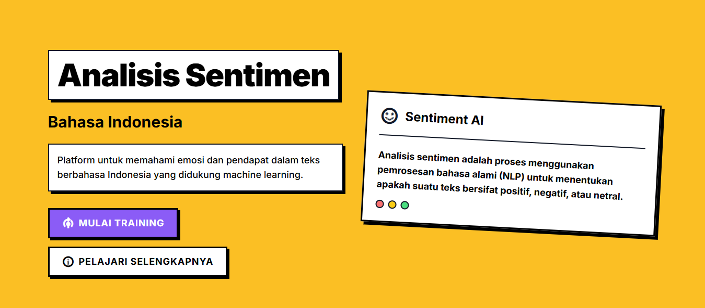

# Aplikasi Analisis Sentimen



Aplikasi web untuk menganalisis sentimen teks menggunakan algoritma Naive Bayes dan CountVectorizer. Aplikasi web ini sepenuhnya menggunakan PHP (termasuk implementasi Machine Learning melalui `php-ml`) untuk antarmuka dan prediksi sentimen bahasa Indonesia. Terdapat pula skrip Python alternatif di dalam folder `scripts/` untuk eksperimen model.

## Fitur

- Preprocessing teks:
  - Konversi emoji ke teks
  - Pembersihan data
  - Penghapusan stopwords
  - Tokenisasi
  - Stemming menggunakan Sastrawi
- Ekstraksi fitur menggunakan CountVectorizer
- Klasifikasi sentimen menggunakan Naive Bayes (Hybrid fallback ke Lexicon)
- Labeling otomatis menggunakan lexicon sentimen
- Visualisasi:
  - Diagram batang probabilitas sentimen
  - Word cloud

## Persyaratan Sistem

- PHP >= 7.4
- Composer
- Web server (Apache/Nginx)
- MySQL / MariaDB
- Python >= 3.8 dengan dependensi: numpy, pandas, scikit-learn, matplotlib, seaborn, mysql-connector-python

## Instalasi

1. Clone repositori ini
2. Install dependensi PHP dengan Composer:
   ```bash
   composer install
   ```
3. Install dependensi Python jika ingin menjalankan skrip evaluasi Python:
   ```bash
   pip install -r requirements.txt
   ```
4. Pastikan direktori `data` dan `models` dapat ditulis oleh web server
5. Buat file konfigurasi database di `config.php`
6. Import skema database dari `database.sql`

## Penggunaan

1. Buka aplikasi di browser
2. Masukkan teks yang ingin dianalisis
3. Klik tombol "Analisis"
4. Hasil analisis akan ditampilkan dalam bentuk:
   - Label sentimen (positif/negatif)
   - Skor sentimen
   - Diagram probabilitas
   - Word cloud

## Struktur Direktori

```
.
├── assets/           # Asset statis (CSS, JS, gambar)
│   ├── css/
│   └── js/
├── data/            # Data dan resource
│   ├── emoji_convert.json
│   ├── emoticons.json
│   ├── english_id.json
│   ├── lexicon/
│   ├── stopwords_id.txt
│   ├── testing/     # File pengujian (tidak di-upload ke GitHub)
│   └── uploads/
├── database/        # Database schema
│   └── schema.sql
├── includes/        # File konfigurasi dan helper
│   ├── config.php
│   ├── memory_helper.php
│   └── nav_template.php
├── lib/             # Library PHP custom
│   ├── CountVectorizer.php
│   ├── MyTokenCountVectorizer.php
│   ├── NaiveBayes.php
│   ├── Preprocessing.php
│   └── Visualization.php
├── models/          # Model machine learning (file besar tidak di-upload ke GitHub)
├── pages/           # Halaman aplikasi
│   ├── about.php
│   ├── analyze.php
│   ├── dataset.php
│   ├── download_dataset.php
│   ├── predict.php
│   ├── result.php
│   └── train.php
├── scripts/         # Python scripts
│   ├── predict.py
│   └── train.py
├── index.php        # Halaman utama
└── composer.json
```

## Catatan Penting

Beberapa file tidak disertakan dalam repositori GitHub karena ukurannya yang besar atau karena merupakan file pengujian:

1. File model machine learning di direktori `models/`:
   - `naive_bayes.dat`
   - `naive_bayes.pkl`
   - `vectorizer.pkl`

2. File pengujian di direktori `data/testing/` dan file test di root direktori.

File-file ini akan dibuat secara otomatis saat menjalankan proses training atau dapat diminta secara terpisah jika diperlukan.

## Lisensi

MIT License
